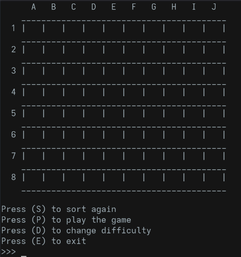
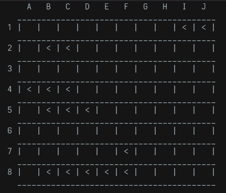
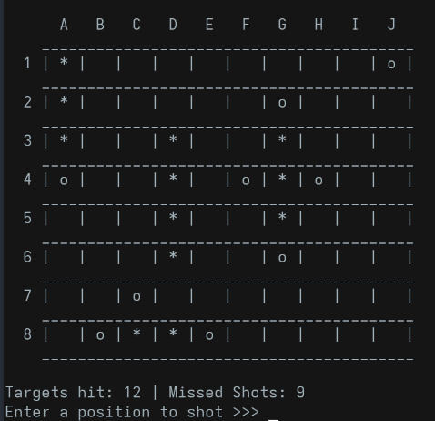

# Battleship

by Victor Correa

Implementation of a terminal based Battleship game written in C.

- [Overview](#overview)
- [Implementation](#implementation)
- [Makefile](#makefile)
- [Compile and Run](#compile-and-run)
- [Outcomes](#outcomes)

## Overview

This is a simple implementation of Battleship for C, as a part of my C language certification which will help me understand better the utilization of vectors in the form of `matrices[][]` and also working with some standard C library such as `time.h` and `stdbool.h`.



This game was designed primarly as a learning project, also focusing on concepts such as **structured programming**, **code organization**, and most important: **modularity**. To achieve these goals in the most simple way, a `Makefile` can be written to help when compiling all code on different sources with only one command.

To achieve modularity, making the program easy to read, understand and maintain, the code was written spliting into multiple source files in the following structure:

    Battleship/
    ├── include/
    │ └── battlemake.h
    ├── src/
    │ ├── board.c
    │ ├── ships.c
    │ ├── game.c
    │ └── main.c
    ├── build/
    │ ├── obj/
    │ ├── bin/
    │ └── asm/
    └── README.md
    └── Makefile

Where each file handles a specific aspect of the game such as:

1. `board.c` - all visual aspects of the game such as drawing and cleaning the board.
2. `ships.c` - to keep the random ship placement across the board.
3. `game.c` - gameplay aspects such as menus and difficulty settings.
4. `main.c` - main function with a loop controller.

## Implementation

During one of Introduction to Programming in C, we were exposed to the concept of randomization in computer science. Using `rand()` function 
to generate random numbers, we can randomly place ships across the board in a battleship game.

By using an algorithm to place the ships randomly across the board, we ensure that ships never overlap and we can always fit ships withing the grid bounds,
placing them both horizontaly or verticaly in a randomized way.

The algorithm follows the following logic:

1. `srand(time(NULL))` initializes random numbers using the hardware time as a seed. We can use `srand(0)` to generate the same random numbers always for debug purposes.
2. Clears the board
3. Select ships according to a difficulty level.
4. Randomly places each ship on the board ensuring no ship overlaps another.

The C implementation for this algorithm:

```c
void newSeed(char (*matrix)[COLS], short difficulty){
    /* Places a ship randomly on the board using the difficult level
    to determine the amount of ships on the board */
    srand(time(NULL));
    // srand(time(0)) // for debug purposes only

    clearBoard(matrix);

    int shipSizes[10];
    int numShips = getShipConfig(difficulty, shipSizes);

    for (int ship = 0; ship < numShips; ship++) {
        int placed = 0;
        int size = shipSizes[ship];

        while(!placed){
            int row = rand() % ROWS;
            int col = rand() % COLS;
            int horizontal = rand() % 2;

            if(canPlaceShip(matrix, row, col, size, horizontal)){
                placeShip(matrix, row, col, size, horizontal);
                placed = 1;
            }
        }

    }
}
```



## Makefile

A makefile is a powerful tool to automate the compilation process, so instead of using a huge `gcc` command every time a change is made on the code, we can simply type `make` and wait for the program to be compiled and linked (or not if there's an error). 

The following flags (options) for the compiler `gcc` are being used for this project:

```makefile
CC := gcc
CFLAGS := -Wall -Wextra -std=c11 -Iinclude
```

- `CC` – Setting the compiler to `gcc`

- `-Wall` – WarningAll enables all common compiler warnings.

- `-Wextra` – Enables extra warnings (good for minor issues or mistakes)

- `-std=c11` – Ensures C11 to be used for compilation.

- `-Iinclude` – Tells compiler to look for header (`*.h`) files in the `include` folder.

For the source and object file variables, we can set:

```makefile
SRC := $(wildcard $(SRC_DIR)/*.c)
OBJ := $(patsubst $(SRC_DIR)/%.c,$(OBJ_DIR)/%.o,$(SRC))
ASM := $(patsubst $(SRC_DIR)/%.c,$(ASM_DIR)/%.s,$(SRC))
```

- `$(wildcard)` – Collects all `.c` files from `src` directory. This automaticaly includes new `.c` files into the compilation process.

- `$(patsubst)` – Generates corresponding `.o` or `.s` (assembly files) filenames in build directories.

The `build` directories are used to separate object files, binaries, and optional assembly from source files.

Linking and compiling source files:

```makefile
# Linking all object files into the final executable, creating the bin directory if it does not exists
$(TARGET): $(OBJ)
	@mkdir -p $(BIN_DIR)
	$(CC) $(CFLAGS) $(OBJ) -o $(TARGET)

# Compiling files
$(OBJ_DIR)/%.o: $(SRC_DIR)/%.c
	@mkdir -p $(OBJ_DIR)
	$(CC) $(CFLAGS) -c $< -o $@
```

Where it compiles each `.c` into a `.o` file.

`$<` - first prerequisite (source file `.c`)

`$@` - target (object file `.o`)

## Compile and Run

To compile the game, run:

```bash
$ make
```

When the compilation finishes, run the game with:

```bash
$ ./build/bin/battlefield
```



## Outcomes

The main objective of this project was achieved: to write a full modular program in C language, and use an automation tool (Makefile) to make it easier to compile.

Implementing such Battefield that work with a simple logic behind them, are good starting point candidates to build knowlege and work with techniques that can be escalated on bigger projects.